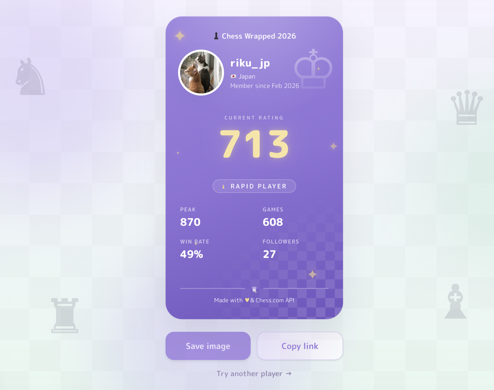

<h1 align="center">Chess Wrapped</h1>

<p align="center">
  <strong>A cute, shareable poster of your chess journey</strong>
</p>

<p align="center">
  <a href="https://chess-wrapped-ruby.vercel.app"><strong>Live demo →</strong></a>
</p>

<p align="center">
  
  
  
</p>

<p align="center">
  
</p>

## About

Generate a pretty poster from any Chess.com username — one you'll want to save and share.


## Why I built this

There are already some amazing Chess Wrapped projects — but I wanted to make one in my own style too.

A little softer. A little cuter.

(And since I only started playing this year, mine wraps up 2026 rather than last year.)

## Features

The poster features:

- Current Rating
- Peak Rating
- Games Played
- Win Rate
- Favorite Game Mode
- Member Since

You can also:

- Download the poster as an image
- Copy a share link

## How it works

- Uses the Chess.com Public API
- No login, no OAuth, no API keys

Player data is fetched, transformed into a small internal model, and rendered into a shareable poster.

## Tech Stack

- Next.js (App Router)
- React
- TypeScript
- Tailwind CSS v4
- Motion
- html-to-image
- Bun

## Quick Start

```bash
bun install
bun dev
```

Open [http://localhost:3000](http://localhost:3000) and try a username:

- hikaru
- magnuscarlsen
- erik

## License

[MIT](LICENSE)

Not affiliated with Chess.com. Built using the Chess.com Public API.
